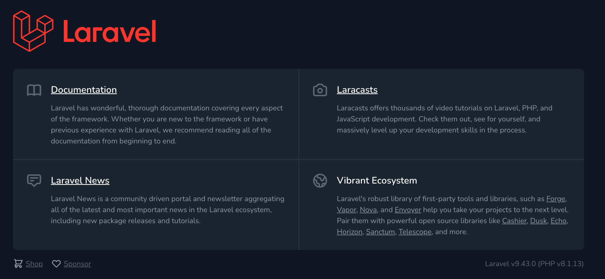
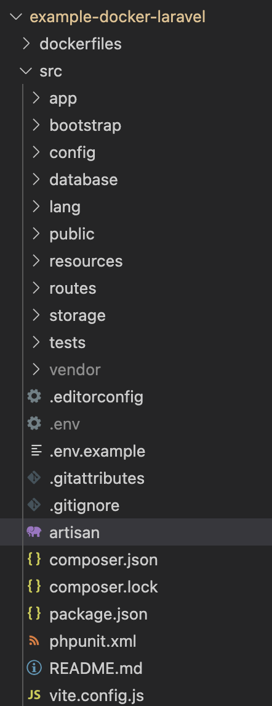
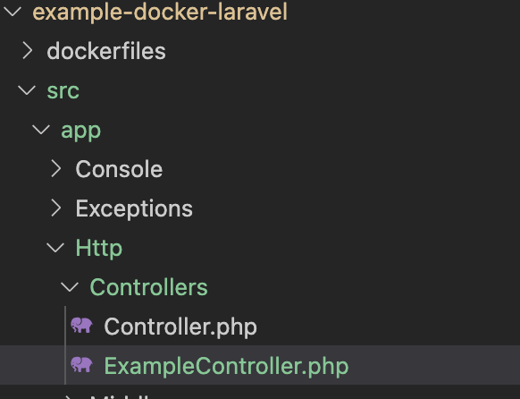

# Laravel via Docker Compose

The intention here was to research the feasibility of using PHP for microservices.


> Laravel is a web application framework with expressive, elegant syntax. We believe development must be an enjoyable, creative experience to be truly fulfilling. Laravel attempts to take the pain out of development by easing common tasks used in the majority of web projects, such as:
>
> - [Simple, fast routing engine](https://laravel.com/docs/routing).
> - [Powerful dependency injection container](https://laravel.com/docs/container).
> - Multiple back-ends for [session](https://laravel.com/docs/session) and [cache](https://laravel.com/docs/cache) storage.
> - Database agnostic [schema migrations](https://laravel.com/docs/migrations).
> - [Robust background job processing](https://laravel.com/docs/queues).
> - [Real-time event broadcasting](https://laravel.com/docs/broadcasting).
>
> Laravel is accessible, yet powerful, providing tools needed for large, robust applications. A superb combination of simplicity, elegance, and innovation gives you a complete toolset required to build any application with which you are tasked.

- https://github.com/laravel/framework

Prerequisites

- Git: https://github.com/jvalentino/setup-git
- Docker: https://github.com/jvalentino/setup-docker

# (1) Setup

## PHP

### Mac

```
brew install php
```


## Composer

> Composer is a tool for dependency management in PHP. It allows you to declare the libraries your project depends on and it will manage (install/update) them for you.

- https://getcomposer.org/doc/00-intro.md

### Mac

```bash
brew install composer
```

## Laravel

Installing laravel via composer:

```bash
composer global require laravel/installer
```

# (2) Running it

```bash
$ docker compose up
```

This will build the needed docker image, and then use it to launch several containers as defined in docker compose for runing the system.

If it doesn't work, due to the fact that we had to hand assemble our own docker image using several different Dockerfiles, it is going to take some existing Docker knowledge with Google.

Consider that all we are doing with the Dockerfile, is automating how to install everything, which in our case is:

- PHP
- MySQL
- nginx
- Redis
- Mailhog

The docker-compose.yml file is then what specifies how to run all those containers.

You know it worked if you see this when you go to http://localhost



# (3) Code Explanation

The primary intention here was RESTful backing services, so I tried to do this in the most simple way possible: A Controller that returns some default JSON.

## src/app/Http/Controller/ExampleController.php

```php
<?php

namespace App\Http\Controllers;

use Illuminate\Http\Request;

class ExampleController extends Controller
{
    public function index()
    {
        return response()->json(['name' => 'John', 'state' => 'TX']);
    }
}
```

This is just a class where the index() return returns a simple JSON payload.

## src/routes/api.php

```php
<?php

use Illuminate\Http\Request;
use Illuminate\Support\Facades\Route;
use App\Http\Controllers\ExampleController;

Route::get('/example', [ExampleController::class, 'index']);
```

This is the routing file, which maps endpoint to controller function. In this case I am staging that an HTTP GET on /api/example results in calling the ExampleController's index() function.

That means that when you call http://localhost/api/example, you get the response of:

```json
{
  	"name":"John",
  	"state":"TX"
}
```

# (4) Test Automation

Consider that all these commands only work in the src directory.

## Default Tests

By Default, there are both an example unit test and then a higher-level feature test:

- src/test/Feature/ExampleTest.php
- src/test/Unit/ExampleTest.php

You execute all the tests using the following:

```bash
~/workspaces/personal/example-docker-laravel/src $ php artisan test

   PASS  Tests\Unit\ExampleTest
  ✓ that true is true

   PASS  Tests\Feature\ExampleTest
  ✓ the application returns a successful response

  Tests:  2 passed
  Time:   0.08s

```

## Writing our own Feature Test

### src/tests/Feature/ExampleControllerTest.php

```php
<?php

namespace Tests\Feature;

// use Illuminate\Foundation\Testing\RefreshDatabase;
use Tests\TestCase;

class ExampleControllerTest extends TestCase
{
    /**
     * A basic test example.
     *
     * @return void
     */
    public function test_index()
    {
        $response = $this->get('/api/example');

        $response
            ->assertStatus(200)
            ->assertJson([
                'name' => "John",
                'state' => "TX",
            ]);
    }
}

```

THis basic tests hits the /api/example endpoint, and asserts that it returns the expected content.

### Running Tests

```bash

~/workspaces/personal/example-docker-laravel/src $ php artisan test

   PASS  Tests\Unit\ExampleTest
  ✓ that true is true

   PASS  Tests\Feature\ExampleControllerTest
  ✓ index

   PASS  Tests\Feature\ExampleTest
  ✓ the application returns a successful response

  Tests:  3 passed
  Time:   0.06s


```


# FAQ

## How did I create the initial codebase?

```bash
composer create-project --prefer-dist laravel/laravel src  
```

This creates the base project under src:



## How did I make the ExampleController?

Artisan can be used within the source directory to create a controller based on the template (note that you have to be in the ./src directory):

```bash
$ php artisan make:controller ExampleController

   INFO  Controller [app/Http/Controllers/ExampleController.php] created successfully.  
```

The end result is:

```php
<?php

namespace App\Http\Controllers;

use Illuminate\Http\Request;

class ExampleController extends Controller
{
    //
}

```

...which is created in:



# References

- https://github.com/aschmelyun/docker-compose-laravel - For showing how to use Docker and Docker Compose to run the entire stack
- https://www.toptal.com/laravel/restful-laravel-api-tutorial - For the basics of generating a new project and creating components within it